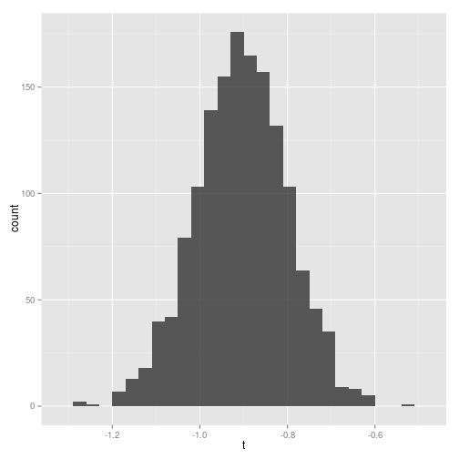
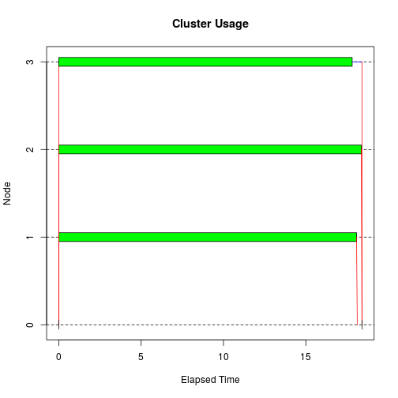
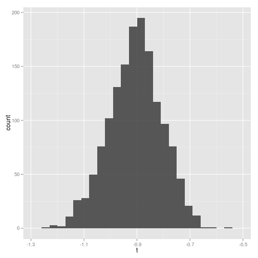
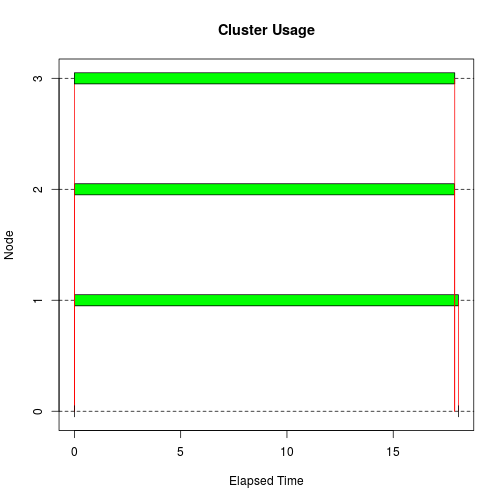
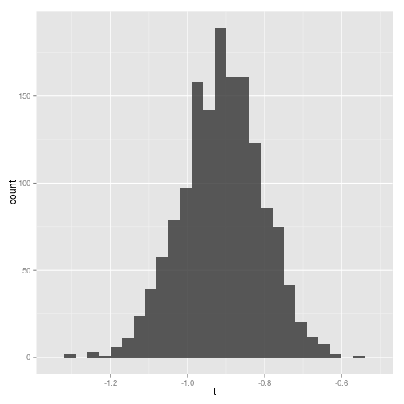
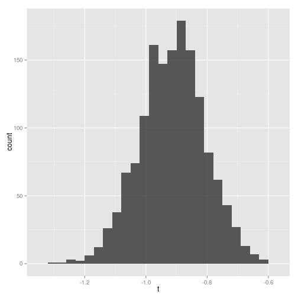
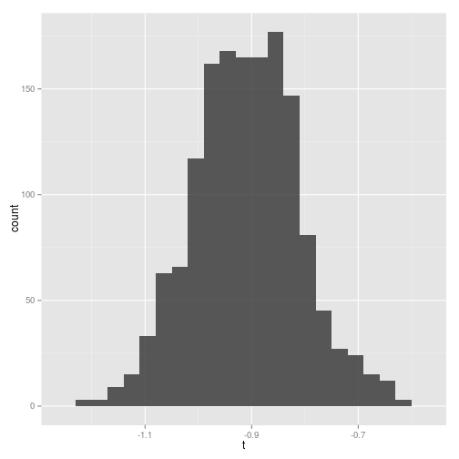
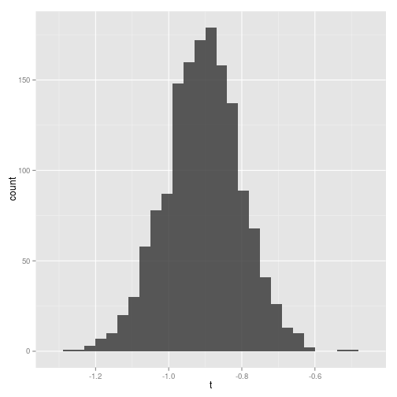
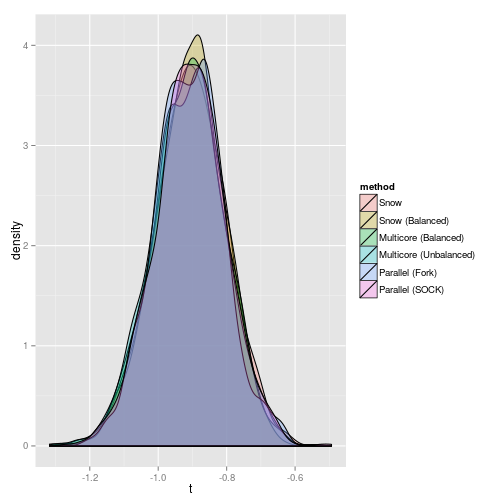

The `sir.adm` data set has five variables in addition to the patient `id`: `pneu` (pneumonia), `status`, `time`, `age`, and `sex`. See the help file for definitions.


```r
library(mvna, quietly=TRUE)
data(sir.adm)
head(sir.adm)
```

```
##     id pneu status time      age sex
## 1   41    0      1    4 75.34153   F
## 2  395    0      1   24 19.17380   M
## 3  710    1      1   37 61.56568   M
## 4 3138    0      1    8 57.88038   F
## 5 3154    0      1    3 39.00639   M
## 6 3178    0      1   24 70.27762   M
```

Fine and Gray developed a Cox regression approach to model the subdistribution hazard function of a specific cause. The cumulative incidence function is given by:

\[P_1(t; x) = 1 - exp\{-\Lambda_1(t)exp(x'\beta)\}\]
where \(\Lambda_1(t)\) is an increasing function and \(\beta\) is a vector of regression coefficients. This model is implemented in the `crr()` function in the `cmprsk` package.


```r
library(cmprsk, quietly=TRUE)
```

```
## Loading required package: splines
```

```r
attach(sir.adm)
system.time(fit <- crr(time, status, pneu))
```

```
##    user  system elapsed 
##   0.039   0.000   0.038
```

```r
summary(fit)
```

```
## Competing Risks Regression
## 
## Call:
## crr(ftime = time, fstatus = status, cov1 = pneu)
## 
##         coef exp(coef) se(coef)     z p-value
## pneu1 -0.907     0.404    0.103 -8.78       0
## 
##       exp(coef) exp(-coef) 2.5% 97.5%
## pneu1     0.404       2.48 0.33 0.494
## 
## Num. cases = 747
## Pseudo Log-likelihood = -3855 
## Pseudo likelihood ratio test = 62.1  on 1 df,
```

The objective is to estimate the coefficient for pneumonia by
bootstrapping. Give the estimate and onstruct a confidence interval on
the estimate in each case below. Also provide a histogram of the
estimates in each approach. In each case do time testing for the basic
fit.

Preparation:

```r
library(ggplot2)
iterative.st <- system.time(fit <- crr(time, status, pneu))
iterative.ci <- c(fit$coef, log(summary(fit)$conf.int[3:4]))
b.hat <- function(data, b.inds) with(data, crr(time, status, pneu, subset=b.inds))$coef
run.boot <- function(...) boot(sir.adm, b.hat, R=500)
get.boot.ci <- function(boot.obj){
  ci.vec <- c(boot.obj$t0, boot.ci(boot.obj, type="norm")$norm[2:3])
  names(ci.vec) <- c("est", "95% Upper", "95% Lower")
  return(ci.vec)
}
boot.hist <- function(boot.obj){
    ggplot(data.frame(t=boot.obj$t), aes(x=t)) +
        geom_histogram(binwidth=0.03, alpha=0.8)
}
```

### 1. Implement the bootstrap model using the `snow` package with 3 workers. Do this using a socket connection. Determine if load balancing and/or I/O create a problem.


```r
library(boot, quietly = TRUE)
```

```
## 
## Attaching package: 'boot'
## 
## The following object is masked from 'package:survival':
## 
##     aml
```

```r
library(snow, quietly=TRUE)
cl <- makeCluster(rep('localhost', 3), type="SOCK")
clusterExport(cl, c("b.hat", "sir.adm"))
invisible(clusterEvalQ(cl, {library(boot); library(cmprsk)}))
(snow.st <- snow.time(snow.boot <- do.call(c, clusterApply(cl, 1:3, run.boot))))$e
```

```
## elapsed 
##  18.406
```

```r
(snow.ci <- get.boot.ci(snow.boot))
```

```
##        est  95% Upper  95% Lower 
## -0.9069256 -1.1144619 -0.7028651
```

```r
boot.hist(snow.boot)
```

 

```r
plot(snow.st)
```

 

Since we are performing the same task on three identical workers, load balancing shouldn't be an issue.  At no point is one cluster waiting for the results of a job before starting another.

As a comparison, we can run the bootstrap using load balancing:


```r
(snow.bal.st <- snow.time(snow.bal.boot <- do.call(c, clusterApplyLB(cl, 1:3, run.boot))))$e
```

```
## elapsed 
##  18.066
```

```r
(snow.bal.ci <- get.boot.ci(snow.bal.boot))
```

```
##        est  95% Upper  95% Lower 
## -0.9069256 -1.1023580 -0.7127220
```

```r
boot.hist(snow.bal.boot)
```

 

```r
stopCluster(cl)
plot(snow.bal.st)
```

 

As expected, the differences in the times are negligible (most of the time -- running this repeatedly sometimes resulted in one method finishing more quickly that the other, but this is probably due to the server being a shared resource).

Using this implementation, we're only passing the (relatively small)
data set once and generating random indices to create the bootstrap
samples, so I/O isn't an issue after the initial export of the data.  We can see this in the relatively straight vertical lines on
the cluster usage plots, which represent the start and end times of the workers' jobs.


### 2. Implement the bootstrap model using the `multicore` package with 3 cores (workers). Explore the load-balancing issue.


```r
library(multicore, quietly=TRUE)
```

```
## WARNING: multicore has been superseded and will be removed shortly
```

```r
mc.unbal.st <- system.time(mc.unbal.boot <- do.call(c, mclapply(1:3, run.boot,
                                                          mc.cores=3)))
(mc.unbal.ci <- get.boot.ci(mc.unbal.boot))
```

```
##        est  95% Upper  95% Lower 
## -0.9069256 -1.1071570 -0.6983173
```

```r
boot.hist(mc.unbal.boot)
```

 

```r
mc.bal.st <- system.time(mc.bal.boot <- do.call(c, mclapply(1:3, run.boot,
                                                        mc.cores=3,
                                                        mc.pre=FALSE))) 
(mc.bal.ci <- get.boot.ci(mc.bal.boot))
```

```
##        est  95% Upper  95% Lower 
## -0.9069256 -1.1074243 -0.6933024
```

```r
boot.hist(mc.bal.boot)
```

 

```r
(mc.st <- rbind(mc.unbal.st, mc.bal.st)[,"elapsed"])
```

```
## mc.unbal.st   mc.bal.st 
##      18.644      22.517
```

Just like with the `snow` implementation, load balancing doesn't
really seem to be an issue here (which we can see from the approximately equal run times).  We are
only running three expressions across the same number of cores, so at
no point is there a core waiting for a job to finish before another
starts. 

### 3. Implement the bootstrap model using the `parallel` package by both the `FORK` and `PSOCK` transports using 3 workers.


```r
detach("package:multicore", unload=TRUE)
detach("package:snow", unload=TRUE)
library(parallel)
cl <- makeForkCluster(3)
par.fork.st <- system.time(fork.boot <- do.call(c, parLapply(cl, 1:3,
                                                          run.boot)))
(par.fork.ci <- get.boot.ci(fork.boot))
```

```
##        est  95% Upper  95% Lower 
## -0.9069256 -1.0992431 -0.7089931
```

```r
boot.hist(fork.boot)
```

 

```r
stopCluster(cl)
cl <- makeCluster(3)
clusterExport(cl, c("b.hat", "sir.adm"))
invisible(clusterEvalQ(cl, {library(boot);library(cmprsk)}))
par.sock.st <- system.time(sock.boot <- do.call(c, parLapply(cl, 1:3, run.boot)))
stopCluster(cl)
(par.sock.ci <- get.boot.ci(sock.boot))
```

```
##        est  95% Upper  95% Lower 
## -0.9069256 -1.1106839 -0.7044675
```

```r
boot.hist(sock.boot)
```

 

```r
(par.st <- rbind(par.fork.st, par.sock.st)[,"elapsed"])
```

```
## par.fork.st par.sock.st 
##      18.379      18.245
```

```r
detach("package:parallel", unload=TRUE)
```

### 4. Compare the execution times (adjusted for the number of samples) for these approaches in 1--4 above to each other and to the non-parallel code given above and discuss.
 

```r
times <- c(iterative.st[3]*1500, snow.st$e, snow.bal.st$e, mc.st, par.st)
CIs <- rbind(iterative.ci, snow.ci, snow.bal.ci, mc.unbal.ci, mc.bal.ci,
             par.fork.ci, par.sock.ci)
results <- data.frame(times, CIs, CIs[,3] - CIs[,2])
rownames(results) <- c("Iterative", "Snow", "Snow (Balanced)",
                       "Multicore (Balanced)",
                       "Multicore (Unbalanced)","Parallel (Fork)", "Parallel (SOCK)")
colnames(results) <- c("Time", "Est.", "95% Lower", "95% Upper",
                       "CI Length") 
round(results, 4)
```

```
##                          Time    Est. 95% Lower 95% Upper CI Length
## Iterative              51.000 -0.9069   -1.1093   -0.7046    0.4047
## Snow                   18.406 -0.9069   -1.1145   -0.7029    0.4116
## Snow (Balanced)        18.066 -0.9069   -1.1024   -0.7127    0.3896
## Multicore (Balanced)   18.644 -0.9069   -1.1072   -0.6983    0.4088
## Multicore (Unbalanced) 22.517 -0.9069   -1.1074   -0.6933    0.4141
## Parallel (Fork)        18.379 -0.9069   -1.0992   -0.7090    0.3902
## Parallel (SOCK)        18.245 -0.9069   -1.1107   -0.7045    0.4062
```

```r
t.tab <- data.frame(snow.boot$t, snow.bal.boot$t, mc.unbal.boot$t,
                    mc.bal.boot$t, fork.boot$t, sock.boot$t)
library(tidyr)
colnames(t.tab) <- rownames(results)[-1]
t.tab <- gather(t.tab, "method", "t")
ggplot(t.tab, aes(x=t, fill=method)) + geom_density(alpha=0.3)
```

 


It's clear that using parallel processing significantly reduces the
run time of the bootstrap estimation, with the run time for the iterative
process taking about three times amount of user time as quickest
parallel version.

There is no clear winner amongst the parallel versions, with typical run-times for all methods being around 32 seconds (varying with what else the server is doing).  Load balancing seemed to have no real impact on the run times -- as mentioned above, we're doing three approximately equally sized jobs on three equal workers.

The resulting estimates and confidence intervals are all fairly similar, and would (theoretically) be closer if more than 1500 bootstrap samples had been used.


