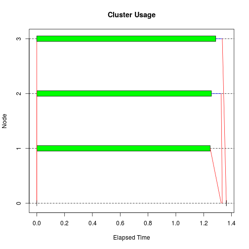

Assignment 1 Parallel Computing.
--------------------------------

The `sir.adm` data set has five variables in addition to the patient `id`: `pneu` (pneumonia), `status`, `time`, `age`, and `sex`. See the help file for definitions.


```r
library(mvna)
data(sir.adm)
head(sir.adm)
```

```
##     id pneu status time      age sex
## 1   41    0      1    4 75.34153   F
## 2  395    0      1   24 19.17380   M
## 3  710    1      1   37 61.56568   M
## 4 3138    0      1    8 57.88038   F
## 5 3154    0      1    3 39.00639   M
## 6 3178    0      1   24 70.27762   M
```

Fine and Gray developed a Cox regression approach to model the subdistribution hazard function of a specific cause. The cumulative incidence function is given by:

\[P_1(t; x) = 1 - exp\{-\Lambda_1(t)exp(x'\beta)\}\]
where \(\Lambda_1(t)\) is an increasing function and \(\beta\) is a vector of regression coefficients. This model is implemented in the `crr()` function in the `cmprsk` package.


```r
library(cmprsk)
# help(crr)
attach(sir.adm)
```

```
## The following objects are masked from sir.adm (pos = 4):
## 
##     age, id, pneu, sex, status, time
## 
## The following objects are masked from sir.adm (pos = 7):
## 
##     age, id, pneu, sex, status, time
```

```r
system.time(fit <- crr(time, status, pneu))
```

```
##    user  system elapsed 
##   0.036   0.000   0.036
```

```r
summary(fit)
```

```
## Competing Risks Regression
## 
## Call:
## crr(ftime = time, fstatus = status, cov1 = pneu)
## 
##         coef exp(coef) se(coef)     z p-value
## pneu1 -0.907     0.404    0.103 -8.78       0
## 
##       exp(coef) exp(-coef) 2.5% 97.5%
## pneu1     0.404       2.48 0.33 0.494
## 
## Num. cases = 747
## Pseudo Log-likelihood = -3855 
## Pseudo likelihood ratio test = 62.1  on 1 df,
```

The objective is to estimate the coefficient for pneumonia by bootstrapping. Give the estimate and construct a confidence interval on the estimate in each case below. Also provide a histogram of the estimates in each approach. In each case do time testing for the basic fit.

1. Implement the bootstrap model using the `snow` package with 3 workers. Do this using a socket connection. Determine if loadbalancing and/or I/O create a problem.


```r
library(boot)

#non-parallel case
# sir.adm.rg <- function(data,p) data[sample(1:nrow(sir.adm),replace=TRUE),]
# sir.adm.coef <- function(data) crr(data$time, data$status, data$pneu)$coef
# sir.adm.boot <- boot(sir.adm, sir.adm.coef, R = 900, sim = "parametric", ran.gen = sir.adm.rg)
# est <- sir.adm.boot$t
# mean(est)
# hist(est,main="Histogram of Estimates", xlab="Estimate of coefficient")
# boot.ci(test,  type = c("norm", "basic", "perc"), conf = 0.9)
```


```r
library(snow)
```

```
## 
## Attaching package: 'snow'
## 
## The following objects are masked from 'package:parallel':
## 
##     clusterApply, clusterApplyLB, clusterCall, clusterEvalQ,
##     clusterExport, clusterMap, clusterSplit, makeCluster,
##     parApply, parCapply, parLapply, parRapply, parSapply,
##     splitIndices, stopCluster
```

```r
run1 <- function(...) 
{
  library(boot)
  library(cmprsk)
  sir.adm.rg <- function(data,p) data[sample(1:nrow(sir.adm),replace=TRUE),]
  sir.adm.coef <- function(data) crr(data$time, data$status, data$pneu)$coef
  boot(sir.adm, sir.adm.coef, R = 30, sim = "parametric", ran.gen = sir.adm.rg)
}

hosts <- c('localhost','localhost','localhost')
cl <- makeCluster(hosts,type="SOCK")

clusterSetupRNG(cl, type='RNGstream', seed=c(1,22,333))
```

```
## Loading required package: rlecuyer
```

```
## Warning in library(package, lib.loc = lib.loc, character.only = TRUE,
## logical.return = TRUE, : there is no package called 'rlecuyer'
```

```
## Error in clusterSetupRNGstream(cl, ...): the `rlecuyer' package is needed for RNGstream support.
```

```r
clusterExport(cl,"sir.adm")

(tm1 <- snow.time(S1results <- do.call(c,clusterApply(cl, rep(300, 3), run1))))
```

```
## elapsed    send receive  node 1  node 2  node 3 
##   1.364   0.000   0.116   1.247   1.256   1.287
```

```r
plot(tm1)
```

 

```r
stopCluster(cl)

est <- S1results$t
mean(est)
```

```
## [1] -0.9141229
```

```r
boot.ci(S1results,  type = c("norm", "basic", "perc"), conf = 0.9)
```

```
## BOOTSTRAP CONFIDENCE INTERVAL CALCULATIONS
## Based on 90 bootstrap replicates
## 
## CALL : 
## boot.ci(boot.out = S1results, conf = 0.9, type = c("norm", "basic", 
##     "perc"))
## 
## Intervals : 
## Level      Normal              Basic              Percentile     
## 90%   (-1.0602, -0.7393 )   (-1.0560, -0.7268 )   (-1.0870, -0.7579 )  
## Calculations and Intervals on Original Scale
## Some basic intervals may be unstable
## Some percentile intervals may be unstable
```

```r
hist(est,main="Histogram of Estimates", xlab="Estimate of coefficient")
```

 

Now try using the `clusterApplyLB()` function from the snow package.


```r
cl <- makeCluster(hosts,type="SOCK")

clusterSetupRNG(cl, type='RNGstream', seed=c(1,22,333))
```

```
## Loading required package: rlecuyer
```

```
## Warning in library(package, lib.loc = lib.loc, character.only = TRUE,
## logical.return = TRUE, : there is no package called 'rlecuyer'
```

```
## Error in clusterSetupRNGstream(cl, ...): the `rlecuyer' package is needed for RNGstream support.
```

```r
clusterExport(cl,"sir.adm")
ignore <- clusterEvalQ(cl, {library(boot); NULL})
ignore <- clusterEvalQ(cl, {library(cmprsk); NULL})

(tm2 <- snow.time(S2results <- do.call(c,clusterApplyLB(cl, rep(300, 3), run1))))
```

```
## elapsed    send receive  node 1  node 2  node 3 
##   1.200   0.000   0.063   1.134   1.136   1.160
```

```r
plot(tm2)
```

 

```r
stopCluster(cl)

est <- S2results$t
mean(est)
```

```
## [1] -0.9160163
```

```r
boot.ci(S2results,  type = c("norm", "basic", "perc"), conf = 0.9)
```

```
## BOOTSTRAP CONFIDENCE INTERVAL CALCULATIONS
## Based on 90 bootstrap replicates
## 
## CALL : 
## boot.ci(boot.out = S2results, conf = 0.9, type = c("norm", "basic", 
##     "perc"))
## 
## Intervals : 
## Level      Normal              Basic              Percentile     
## 90%   (-1.0909, -0.7047 )   (-1.0990, -0.6985 )   (-1.1153, -0.7149 )  
## Calculations and Intervals on Original Scale
## Some basic intervals may be unstable
## Some percentile intervals may be unstable
```

```r
hist(est,main="Histogram of Estimates", xlab="Estimate of coefficient")
```

 

Finally, try using the function `parLapply()` from the snow package.


```r
cl <- makeCluster(hosts,type="SOCK")

clusterSetupRNG(cl, type='RNGstream', seed=c(1,22,333))
```

```
## Loading required package: rlecuyer
```

```
## Warning in library(package, lib.loc = lib.loc, character.only = TRUE,
## logical.return = TRUE, : there is no package called 'rlecuyer'
```

```
## Error in clusterSetupRNGstream(cl, ...): the `rlecuyer' package is needed for RNGstream support.
```

```r
clusterExport(cl,"sir.adm")
ignore <- clusterEvalQ(cl, {library(boot); NULL})
ignore <- clusterEvalQ(cl, {library(cmprsk); NULL})

(tm3 <- snow.time(S3results <- do.call(c,parLapply(cl, rep(300, 3), run1))))
```

```
## elapsed    send receive  node 1  node 2  node 3 
##   1.233   0.001   0.077   1.128   1.194   1.139
```

```r
plot(tm3)
```

 

```r
stopCluster(cl)

est <- S3results$t
mean(est)
```

```
## [1] -0.9153007
```

```r
boot.ci(S3results,  type = c("norm", "basic", "perc"), conf = 0.9)
```

```
## BOOTSTRAP CONFIDENCE INTERVAL CALCULATIONS
## Based on 90 bootstrap replicates
## 
## CALL : 
## boot.ci(boot.out = S3results, conf = 0.9, type = c("norm", "basic", 
##     "perc"))
## 
## Intervals : 
## Level      Normal              Basic              Percentile     
## 90%   (-1.0718, -0.7253 )   (-1.0674, -0.6849 )   (-1.1289, -0.7464 )  
## Calculations and Intervals on Original Scale
## Some basic intervals may be unstable
## Some percentile intervals may be unstable
```

```r
hist(est,main="Histogram of Estimates", xlab="Estimate of coefficient")
```

 


2. Implement the bootstrap model using the `multicore` package with 3 cores (workers). Explore the load-balancing issue.


```r
library(multicore)

run1 <- function(...) 
{
  library(boot)
  library(cmprsk)
  #data(sir.adm)
  sir.adm.rg <- function(data,p) data[sample(1:nrow(sir.adm),replace=TRUE),]
  sir.adm.coef <- function(data) crr(data$time, data$status, data$pneu)$coef
  boot(sir.adm, sir.adm.coef, R = 300, sim = "parametric", ran.gen = sir.adm.rg)
}

system.time(MCresults <- do.call(c,mclapply(seq_len(3), run1, mc.set.seed=TRUE)))
```

```
##    user  system elapsed 
##  21.215   0.028  20.929
```

```r
est <- MCresults$t
mean(est)
```

```
## [1] -0.9162649
```

```r
boot.ci(MCresults,  type = c("norm", "basic", "perc"), conf = 0.9)
```

```
## BOOTSTRAP CONFIDENCE INTERVAL CALCULATIONS
## Based on 900 bootstrap replicates
## 
## CALL : 
## boot.ci(boot.out = MCresults, conf = 0.9, type = c("norm", "basic", 
##     "perc"))
## 
## Intervals : 
## Level      Normal              Basic              Percentile     
## 90%   (-1.0755, -0.7197 )   (-1.0766, -0.7276 )   (-1.0863, -0.7372 )  
## Calculations and Intervals on Original Scale
```

```r
hist(est,main="Histogram of Estimates", xlab="Estimate of coefficient")
```

 

Try without pre-scheduling


```r
system.time(MCresults <- do.call(c,mclapply(seq_len(3), run1, mc.set.seed=TRUE, mc.preschedule = FALSE)))
```

```
##    user  system elapsed 
##  42.213   0.064  20.936
```

No prescheduling takes longer time.

3. Implement the bootstrap model using the `parallel` package by both the `FORK` and `PSOCK` transports using 3 workers.


```r
library(parallel)

run1 <- function(...) 
{
  library(boot)
  library(cmprsk)
  #data(sir.adm)
  sir.adm.rg <- function(data,p) data[sample(1:nrow(sir.adm),replace=TRUE),]
  sir.adm.coef <- function(data) crr(data$time, data$status, data$pneu)$coef
  boot(sir.adm, sir.adm.coef, R = 300, sim = "parametric", ran.gen = sir.adm.rg)
}

cl <- makeCluster(3) #PSOCK type
clusterSetRNGStream(cl, 123)

clusterExport(cl,"sir.adm")
#ignore <- clusterEvalQ(cl, {library(boot); NULL})
#ignore <- clusterEvalQ(cl, {library(cmprsk); NULL})

system.time(P1results <- do.call(c, parLapply(cl, seq_len(3), run1)))
```

```
##    user  system elapsed 
##   0.003   0.000  11.222
```

```r
stopCluster(cl)

est <- P1results$t
mean(est)
```

```
## [1] -0.90774
```

```r
boot.ci(P1results,  type = c("norm", "basic", "perc"), conf = 0.9)
```

```
## BOOTSTRAP CONFIDENCE INTERVAL CALCULATIONS
## Based on 900 bootstrap replicates
## 
## CALL : 
## boot.ci(boot.out = P1results, conf = 0.9, type = c("norm", "basic", 
##     "perc"))
## 
## Intervals : 
## Level      Normal              Basic              Percentile     
## 90%   (-1.0741, -0.7381 )   (-1.0723, -0.7306 )   (-1.0832, -0.7415 )  
## Calculations and Intervals on Original Scale
```

```r
hist(est,main="Histogram of Estimates", xlab="Estimate of coefficient")
```

 

Now try `FORK` transport


```r
detach("package:snow", unload=T)
library(parallel)

run2 <- function(...) 
{
  #library(boot)
  #library(cmprsk)
  #data(sir.adm); sir.adm
  sir.adm.rg <- function(data,p) data[sample(1:nrow(sir.adm),replace=TRUE),]
  sir.adm.coef <- function(data) crr(data$time, data$status, data$pneu)$coef
  boot(sir.adm, sir.adm.coef, R = 300, sim = "parametric", ran.gen = sir.adm.rg)
}

#cl <- parallel::makeCluster(3, type="FORK")
cl <- makeForkCluster(3)
clusterSetRNGStream(cl, 123)

clusterExport(cl,"sir.adm")

system.time(P2results <- do.call(c, parLapply(cl, seq_len(3), run1)))
```

```
##    user  system elapsed 
##   0.002   0.000  11.144
```

```r
stopCluster(cl)

est <- P2results$t
mean(est)
```

```
## [1] -0.90774
```

```r
boot.ci(P2results,  type = c("norm", "basic", "perc"), conf = 0.9)
```

```
## BOOTSTRAP CONFIDENCE INTERVAL CALCULATIONS
## Based on 900 bootstrap replicates
## 
## CALL : 
## boot.ci(boot.out = P2results, conf = 0.9, type = c("norm", "basic", 
##     "perc"))
## 
## Intervals : 
## Level      Normal              Basic              Percentile     
## 90%   (-1.0741, -0.7381 )   (-1.0723, -0.7306 )   (-1.0832, -0.7415 )  
## Calculations and Intervals on Original Scale
```

```r
hist(est,main="Histogram of Estimates", xlab="Estimate of coefficient")
```

 

```r
detach("package:parallel", unload=T)
```

```
## Warning: 'parallel' namespace cannot be unloaded:
##   namespace 'parallel' is imported by 'multicore' so cannot be unloaded
```

Using the `FORK` transport the execution time is slower??

4. Compare the execution times (adjusted for the number of samples) for these approaches in 1--4 above to each other and to the non-parallel code given above and discuss.
 


