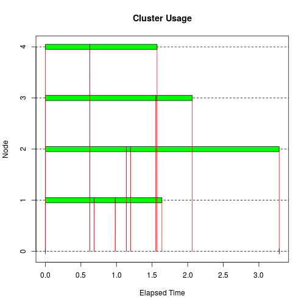
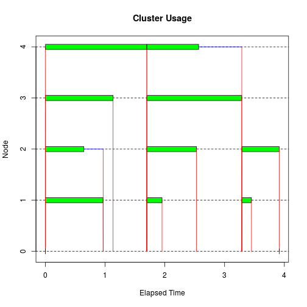
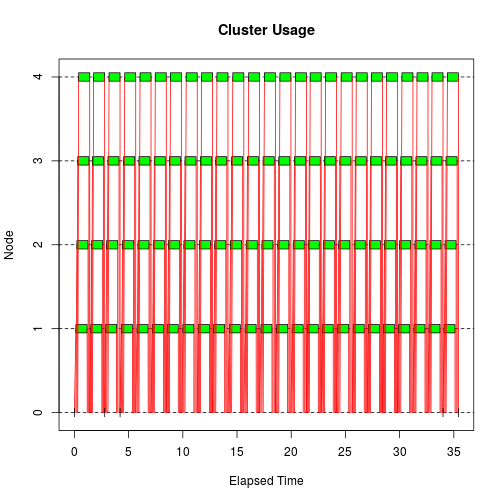
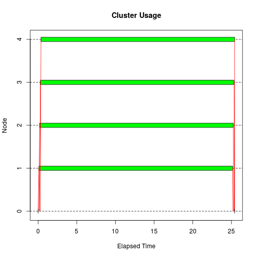
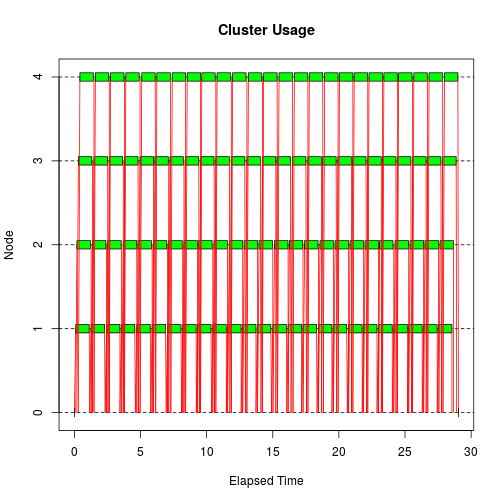
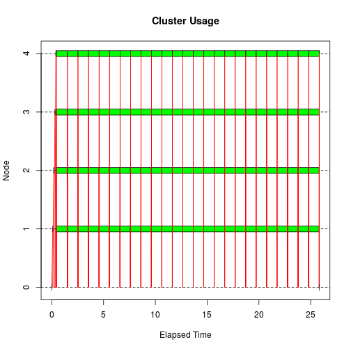

## Quick Look

Use `snow` on a Linux cluster to run an R script faster, e.g., to run a Monte Carlo simulation. This fits well into a traditional cluster environment, and is able to take
advantage of high-speed communication networks, such as InfiniBand, using MPI.

## Setting Up

`snow` can be installed by:

```r
install.packages("snow")
```

```
## Installing package into '/home/raffle/R/x86_64-pc-linux-gnu-library/3.0'
## (as 'lib' is unspecified)
```

```
## 
## The downloaded source packages are in
## 	'/tmp/RtmpdUk3jH/downloaded_packages'
```
To use snow with MPI, you will also need to install the `Rmpi` package. Unfortunately, installing Rmpi is a frequent cause of problems because it has an external dependency on MPI.

## How It Works

`snow` provides support for easily executing R functions in parallel. 

snow:

* executes R functions, e.g., `lapply()`in parallel  
* uses a master/worker architecture  
* uses different transport mechanisms between the master and workers  
  * socket connections (popular on multicore computers)   
  * MPI or PVM (popular on Linux clusters)  
  * NetWorkSpaces  
The socket transport doesn’t require any additional packages, and is the most portable. MPI is supported via the `Rmpi` package, PVM via `rpvm`, and NetWorkSpaces via `nws`. 

`snow` is primarily intended for clusters with MPI.

## Working with It

In order to execute any functions in parallel with `snow`, you must first create a cluster object. The cluster object is used to interact with the cluster workers, and is passed as the first argument to many of the snow functions. You can create different types of cluster objects, depending on the transport mechanism that you wish to use.

The basic cluster creation function is `makeCluster()` which can create any type of cluster.

```r
library(snow)
hosts <- c('localhost', 'localhost', 'localhost', 'localhost')
cl <- makeCluster(hosts, type="SOCK")
cl
```

```
## [[1]]
## $con
##         description               class                mode 
## "<-localhost:11021"          "sockconn"               "a+b" 
##                text              opened            can read 
##            "binary"            "opened"               "yes" 
##           can write 
##               "yes" 
## 
## $host
## [1] "localhost"
## 
## $rank
## [1] 1
## 
## attr(,"class")
## [1] "SOCKnode"
## 
## [[2]]
## $con
##         description               class                mode 
## "<-localhost:11021"          "sockconn"               "a+b" 
##                text              opened            can read 
##            "binary"            "opened"               "yes" 
##           can write 
##               "yes" 
## 
## $host
## [1] "localhost"
## 
## $rank
## [1] 2
## 
## attr(,"class")
## [1] "SOCKnode"
## 
## [[3]]
## $con
##         description               class                mode 
## "<-localhost:11021"          "sockconn"               "a+b" 
##                text              opened            can read 
##            "binary"            "opened"               "yes" 
##           can write 
##               "yes" 
## 
## $host
## [1] "localhost"
## 
## $rank
## [1] 3
## 
## attr(,"class")
## [1] "SOCKnode"
## 
## [[4]]
## $con
##         description               class                mode 
## "<-localhost:11021"          "sockconn"               "a+b" 
##                text              opened            can read 
##            "binary"            "opened"               "yes" 
##           can write 
##               "yes" 
## 
## $host
## [1] "localhost"
## 
## $rank
## [1] 4
## 
## attr(,"class")
## [1] "SOCKnode"
## 
## attr(,"class")
## [1] "SOCKcluster" "cluster"
```

```r
stopCluster(cl)
```
The first argument of makeCluster is the *cluster specification* and the second is the *cluster type*. The type argument can be: SOCK, MPI, PVM, and NWS.

Socket clusters also allow you to specify the worker machines as a character vector. The socket transport launches each of these workers via the `ssh` command unless the name is `localhost`, in which case `makeCluster()` starts the worker itself.

### Parallel K-Means

K-Means is a clustering algorithm that partitions rows of a dataset into $k$ clusters. It’s an iterative algorithm, since it starts with a guess of the location for each of the cluster centers, and gradually improves the center locations until it converges on a solution.

R includes a function for performing K-Means clustering in the stats package: the `kmeans()` function. One way of using the `kmeans()` function is to specify the number of cluster centers, and `kmeans()` will pick the starting points for the centers by randomly selecting that number of rows from your dataset. After it iterates to a solution, it computes a value called the *total within-cluster sum of squares*. It then selects another set of rows for the starting points, and repeats this process in an attempt to find a solution with a smallest *total within-cluster sum of squares*.


```r
library(MASS)
result <- kmeans(Boston, 4, nstart=100)
```

Now use this technique using the `lapply()` function to make sure it works.

```r
results <- lapply(rep(25, 4), function(nstart) kmeans(Boston, 4, nstart=nstart))
i <- sapply(results, function(result) result$tot.withinss)
i
```

```
## [1] 1814438 1814438 1814438 1814438
```

```r
result <- results[[which.min(i)]]
result
```

```
## K-means clustering with 4 clusters of sizes 98, 38, 268, 102
## 
## Cluster means:
##         crim       zn     indus       chas       nox       rm      age
## 1  0.7412906  9.94898 12.983776 0.06122449 0.5822347 6.189847 73.28878
## 2 15.2190382  0.00000 17.926842 0.02631579 0.6737105 6.065500 89.90526
## 3  0.2410479 17.81716  6.668582 0.07462687 0.4833981 6.465448 55.70522
## 4 10.9105113  0.00000 18.572549 0.07843137 0.6712255 5.982265 89.91373
##        dis       rad      tax  ptratio     black     lstat     medv
## 1 3.331821  4.826531 406.0816 17.66633 371.66429 12.714898 22.37857
## 2 1.994429 22.500000 644.7368 19.92895  57.78632 20.448684 13.12632
## 3 4.873560  4.313433 276.5485 17.87313 387.81407  9.538022 25.86530
## 4 2.077164 23.019608 668.2059 20.19510 371.80304 17.874020 17.42941
## 
## Clustering vector:
##   1   2   3   4   5   6   7   8   9  10  11  12  13  14  15  16  17  18 
##   3   3   3   3   3   3   3   3   3   3   3   3   3   3   3   3   3   3 
##  19  20  21  22  23  24  25  26  27  28  29  30  31  32  33  34  35  36 
##   3   3   3   3   3   3   3   3   3   3   3   3   3   3   3   3   3   3 
##  37  38  39  40  41  42  43  44  45  46  47  48  49  50  51  52  53  54 
##   3   3   3   3   3   3   3   3   3   3   3   3   3   3   3   3   3   3 
##  55  56  57  58  59  60  61  62  63  64  65  66  67  68  69  70  71  72 
##   1   3   3   3   3   3   3   3   3   3   3   3   3   3   3   3   3   3 
##  73  74  75  76  77  78  79  80  81  82  83  84  85  86  87  88  89  90 
##   3   3   1   1   1   1   1   1   3   3   3   3   3   3   3   3   3   3 
##  91  92  93  94  95  96  97  98  99 100 101 102 103 104 105 106 107 108 
##   3   3   3   3   3   3   3   3   3   3   1   1   2   1   1   1   1   1 
## 109 110 111 112 113 114 115 116 117 118 119 120 121 122 123 124 125 126 
##   1   1   1   1   1   1   1   1   1   1   1   1   3   3   3   3   3   3 
## 127 128 129 130 131 132 133 134 135 136 137 138 139 140 141 142 143 144 
##   3   1   1   1   1   1   1   1   1   1   1   1   1   1   1   1   1   1 
## 145 146 147 148 149 150 151 152 153 154 155 156 157 158 159 160 161 162 
##   1   1   1   1   1   1   1   1   1   1   1   2   2   1   1   1   1   1 
## 163 164 165 166 167 168 169 170 171 172 173 174 175 176 177 178 179 180 
##   1   1   1   1   1   1   1   1   1   1   3   3   3   3   3   3   3   3 
## 181 182 183 184 185 186 187 188 189 190 191 192 193 194 195 196 197 198 
##   3   3   3   3   3   3   3   1   1   1   1   1   1   3   3   3   3   3 
## 199 200 201 202 203 204 205 206 207 208 209 210 211 212 213 214 215 216 
##   3   1   1   3   3   3   3   3   3   3   3   3   3   3   3   3   3   3 
## 217 218 219 220 221 222 223 224 225 226 227 228 229 230 231 232 233 234 
##   3   3   3   3   3   3   3   3   3   3   3   3   3   3   3   3   3   3 
## 235 236 237 238 239 240 241 242 243 244 245 246 247 248 249 250 251 252 
##   3   3   3   3   3   3   3   3   3   3   3   3   3   3   3   3   3   3 
## 253 254 255 256 257 258 259 260 261 262 263 264 265 266 267 268 269 270 
##   3   3   3   3   3   3   3   3   3   3   3   3   3   3   3   3   3   3 
## 271 272 273 274 275 276 277 278 279 280 281 282 283 284 285 286 287 288 
##   3   3   3   3   3   3   3   3   3   3   3   3   3   3   3   3   3   3 
## 289 290 291 292 293 294 295 296 297 298 299 300 301 302 303 304 305 306 
##   3   3   3   3   3   3   3   3   3   3   1   1   1   3   3   3   3   3 
## 307 308 309 310 311 312 313 314 315 316 317 318 319 320 321 322 323 324 
##   3   3   3   3   3   3   3   3   3   3   3   3   3   3   3   3   3   3 
## 325 326 327 328 329 330 331 332 333 334 335 336 337 338 339 340 341 342 
##   3   3   3   3   1   1   1   3   3   3   3   3   3   3   3   3   3   3 
## 343 344 345 346 347 348 349 350 351 352 353 354 355 356 357 358 359 360 
##   1   1   1   1   1   3   3   3   3   1   1   3   3   3   4   4   4   4 
## 361 362 363 364 365 366 367 368 369 370 371 372 373 374 375 376 377 378 
##   4   4   4   4   4   4   4   2   4   4   4   4   4   4   4   4   4   4 
## 379 380 381 382 383 384 385 386 387 388 389 390 391 392 393 394 395 396 
##   4   4   4   4   4   4   4   4   4   4   4   4   4   4   4   4   4   4 
## 397 398 399 400 401 402 403 404 405 406 407 408 409 410 411 412 413 414 
##   4   4   4   4   4   4   4   4   4   4   4   4   4   2   2   2   2   2 
## 415 416 417 418 419 420 421 422 423 424 425 426 427 428 429 430 431 432 
##   2   2   2   2   2   2   4   4   4   2   2   2   2   2   2   2   2   2 
## 433 434 435 436 437 438 439 440 441 442 443 444 445 446 447 448 449 450 
##   2   2   2   2   2   2   2   4   4   4   4   4   4   2   4   4   4   4 
## 451 452 453 454 455 456 457 458 459 460 461 462 463 464 465 466 467 468 
##   2   4   4   4   2   2   2   2   4   4   4   4   4   4   4   4   2   4 
## 469 470 471 472 473 474 475 476 477 478 479 480 481 482 483 484 485 486 
##   4   4   4   4   4   4   4   4   4   4   4   4   4   4   4   4   4   4 
## 487 488 489 490 491 492 493 494 495 496 497 498 499 500 501 502 503 504 
##   4   4   4   4   4   4   4   1   1   1   1   1   1   1   1   3   3   3 
## 505 506 
##   3   3 
## 
## Within cluster sum of squares by cluster:
## [1] 395218.3 313208.7 924118.8 181891.7
##  (between_SS / total_SS =  90.6 %)
## 
## Available components:
## 
## [1] "cluster"      "centers"      "totss"        "withinss"    
## [5] "tot.withinss" "betweenss"    "size"         "iter"        
## [9] "ifault"
```
We used a vector of four 25s to specify the `nstart` argument in order to get equivalent results to using 100 in a single call to `kmeans()`.

`snow` includes a number of functions that we could use, including `clusterApply()`, `clusterApplyLB()`, and `parLapply()`. For this example, we’ll use `clusterApply()`. You call it exactly the same as `lapply()`, except that it takes a snow cluster object as the first argument. We also need to load `MASS` on the workers, rather than on the master, since it’s the workers that use the “Boston” dataset.

```r
cl <- makeCluster(hosts, type="SOCK")
ignore <- clusterEvalQ(cl, {library(MASS); NULL})
results <- clusterApply(cl, rep(25, 4),
                        function(nstart) kmeans(Boston, 4, nstart=nstart))
i <- sapply(results, function(result) result$tot.withinss)
result <- results[[which.min(i)]]
result
```

```
## K-means clustering with 4 clusters of sizes 38, 102, 268, 98
## 
## Cluster means:
##         crim       zn     indus       chas       nox       rm      age
## 1 15.2190382  0.00000 17.926842 0.02631579 0.6737105 6.065500 89.90526
## 2 10.9105113  0.00000 18.572549 0.07843137 0.6712255 5.982265 89.91373
## 3  0.2410479 17.81716  6.668582 0.07462687 0.4833981 6.465448 55.70522
## 4  0.7412906  9.94898 12.983776 0.06122449 0.5822347 6.189847 73.28878
##        dis       rad      tax  ptratio     black     lstat     medv
## 1 1.994429 22.500000 644.7368 19.92895  57.78632 20.448684 13.12632
## 2 2.077164 23.019608 668.2059 20.19510 371.80304 17.874020 17.42941
## 3 4.873560  4.313433 276.5485 17.87313 387.81407  9.538022 25.86530
## 4 3.331821  4.826531 406.0816 17.66633 371.66429 12.714898 22.37857
## 
## Clustering vector:
##   1   2   3   4   5   6   7   8   9  10  11  12  13  14  15  16  17  18 
##   3   3   3   3   3   3   3   3   3   3   3   3   3   3   3   3   3   3 
##  19  20  21  22  23  24  25  26  27  28  29  30  31  32  33  34  35  36 
##   3   3   3   3   3   3   3   3   3   3   3   3   3   3   3   3   3   3 
##  37  38  39  40  41  42  43  44  45  46  47  48  49  50  51  52  53  54 
##   3   3   3   3   3   3   3   3   3   3   3   3   3   3   3   3   3   3 
##  55  56  57  58  59  60  61  62  63  64  65  66  67  68  69  70  71  72 
##   4   3   3   3   3   3   3   3   3   3   3   3   3   3   3   3   3   3 
##  73  74  75  76  77  78  79  80  81  82  83  84  85  86  87  88  89  90 
##   3   3   4   4   4   4   4   4   3   3   3   3   3   3   3   3   3   3 
##  91  92  93  94  95  96  97  98  99 100 101 102 103 104 105 106 107 108 
##   3   3   3   3   3   3   3   3   3   3   4   4   1   4   4   4   4   4 
## 109 110 111 112 113 114 115 116 117 118 119 120 121 122 123 124 125 126 
##   4   4   4   4   4   4   4   4   4   4   4   4   3   3   3   3   3   3 
## 127 128 129 130 131 132 133 134 135 136 137 138 139 140 141 142 143 144 
##   3   4   4   4   4   4   4   4   4   4   4   4   4   4   4   4   4   4 
## 145 146 147 148 149 150 151 152 153 154 155 156 157 158 159 160 161 162 
##   4   4   4   4   4   4   4   4   4   4   4   1   1   4   4   4   4   4 
## 163 164 165 166 167 168 169 170 171 172 173 174 175 176 177 178 179 180 
##   4   4   4   4   4   4   4   4   4   4   3   3   3   3   3   3   3   3 
## 181 182 183 184 185 186 187 188 189 190 191 192 193 194 195 196 197 198 
##   3   3   3   3   3   3   3   4   4   4   4   4   4   3   3   3   3   3 
## 199 200 201 202 203 204 205 206 207 208 209 210 211 212 213 214 215 216 
##   3   4   4   3   3   3   3   3   3   3   3   3   3   3   3   3   3   3 
## 217 218 219 220 221 222 223 224 225 226 227 228 229 230 231 232 233 234 
##   3   3   3   3   3   3   3   3   3   3   3   3   3   3   3   3   3   3 
## 235 236 237 238 239 240 241 242 243 244 245 246 247 248 249 250 251 252 
##   3   3   3   3   3   3   3   3   3   3   3   3   3   3   3   3   3   3 
## 253 254 255 256 257 258 259 260 261 262 263 264 265 266 267 268 269 270 
##   3   3   3   3   3   3   3   3   3   3   3   3   3   3   3   3   3   3 
## 271 272 273 274 275 276 277 278 279 280 281 282 283 284 285 286 287 288 
##   3   3   3   3   3   3   3   3   3   3   3   3   3   3   3   3   3   3 
## 289 290 291 292 293 294 295 296 297 298 299 300 301 302 303 304 305 306 
##   3   3   3   3   3   3   3   3   3   3   4   4   4   3   3   3   3   3 
## 307 308 309 310 311 312 313 314 315 316 317 318 319 320 321 322 323 324 
##   3   3   3   3   3   3   3   3   3   3   3   3   3   3   3   3   3   3 
## 325 326 327 328 329 330 331 332 333 334 335 336 337 338 339 340 341 342 
##   3   3   3   3   4   4   4   3   3   3   3   3   3   3   3   3   3   3 
## 343 344 345 346 347 348 349 350 351 352 353 354 355 356 357 358 359 360 
##   4   4   4   4   4   3   3   3   3   4   4   3   3   3   2   2   2   2 
## 361 362 363 364 365 366 367 368 369 370 371 372 373 374 375 376 377 378 
##   2   2   2   2   2   2   2   1   2   2   2   2   2   2   2   2   2   2 
## 379 380 381 382 383 384 385 386 387 388 389 390 391 392 393 394 395 396 
##   2   2   2   2   2   2   2   2   2   2   2   2   2   2   2   2   2   2 
## 397 398 399 400 401 402 403 404 405 406 407 408 409 410 411 412 413 414 
##   2   2   2   2   2   2   2   2   2   2   2   2   2   1   1   1   1   1 
## 415 416 417 418 419 420 421 422 423 424 425 426 427 428 429 430 431 432 
##   1   1   1   1   1   1   2   2   2   1   1   1   1   1   1   1   1   1 
## 433 434 435 436 437 438 439 440 441 442 443 444 445 446 447 448 449 450 
##   1   1   1   1   1   1   1   2   2   2   2   2   2   1   2   2   2   2 
## 451 452 453 454 455 456 457 458 459 460 461 462 463 464 465 466 467 468 
##   1   2   2   2   1   1   1   1   2   2   2   2   2   2   2   2   1   2 
## 469 470 471 472 473 474 475 476 477 478 479 480 481 482 483 484 485 486 
##   2   2   2   2   2   2   2   2   2   2   2   2   2   2   2   2   2   2 
## 487 488 489 490 491 492 493 494 495 496 497 498 499 500 501 502 503 504 
##   2   2   2   2   2   2   2   4   4   4   4   4   4   4   4   3   3   3 
## 505 506 
##   3   3 
## 
## Within cluster sum of squares by cluster:
## [1] 313208.7 181891.7 924118.8 395218.3
##  (between_SS / total_SS =  90.6 %)
## 
## Available components:
## 
## [1] "cluster"      "centers"      "totss"        "withinss"    
## [5] "tot.withinss" "betweenss"    "size"         "iter"        
## [9] "ifault"
```
`clusterEvalQ()` takes two arguments: the cluster object, and an expression that is evaluated on each of the workers. Returning `NULL` guarantees that we don’t accidentally send unnecessary data transfer back to the master.

As you can see, the snow version isn’t that much different than the `lapply()` version. Most of the work was done in converting it to use `lapply()`. Usually the biggest problem in converting from `lapply()` to one of the parallel operations is handling the data properly and efficiently.

### Installing Workers

`clusterEvalQ()` can initialize the cluster workers by loading a package on each of them. It’s great for executing a simple expression on the cluster workers, but it doesn’t allow you to pass any kind of parameters to the expression. Also, although you can use it to execute a function, it won’t send that function to the worker first.

`clusterCall()` takes a snow cluster object, a worker function, and any number of arguments to pass to the function. It simply calls the function with the specified arguments on each of the cluster workers, and returns the results as a list. 

We can use `clusterCall()` to load the `MASS` package on the cluster workers.

```r
clusterCall(cl, function() { library(MASS); NULL })
```

```
## [[1]]
## NULL
## 
## [[2]]
## NULL
## 
## [[3]]
## NULL
## 
## [[4]]
## NULL
```

The following will load several packages specified by a character vector:

```r
worker.init <- function(packages) {
  for (p in packages) {
  library(p, character.only=TRUE) }
NULL }
clusterCall(cl, worker.init, c('MASS', 'boot'))
```

```
## [[1]]
## NULL
## 
## [[2]]
## NULL
## 
## [[3]]
## NULL
## 
## [[4]]
## NULL
```
Setting the character.only argument to `TRUE` makes `library()` interpret the argument as a character variable. If we didn’t do that, `library()` would attempt to load a package named `p` repeatedly.

The `clusterApply()` function is also useful for initializing the cluster workers since it can send different data to the initialization function for each worker. The following creates a global variable on each of the cluster workers that can be used as a unique worker ID:

```r
clusterApply(cl, seq(along=cl), function(id) WORKER.ID <<- id)
```

```
## [[1]]
## [1] 1
## 
## [[2]]
## [1] 2
## 
## [[3]]
## [1] 3
## 
## [[4]]
## [1] 4
```

```r
stopCluster(cl)
```

### Load Balancing with clusterApplyLB

`clusterApply()` schedules tasks in a round-robin way; `clusterApplyLB()` sends tasks to workers as they complete their previous task.

`clusterApply()` pushes tasks to the workers, while `clusterApplyLB()` lets the workers pull tasks as needed. That can be more efficient if some tasks take longer than others, or if some cluster workers are slower.

To demonstrate clusterApplyLB(), we’ll execute Sys.sleep() on the workers, giving us complete control over the task lengths. Since our real interest in using cluster ApplyLB() is to improve performance, we’ll use snow.time() to gather timing information about the overall execution.‡ We will also use snow.time()’s plotting capability to visualize the task execution on the workers:

```r
cl <- makeCluster(hosts, type="SOCK")
sleeptime <- abs(rnorm(10))
tm <- snow.time(clusterApplyLB(cl, sleeptime, Sys.sleep))
plot(tm)
```

 

```r
stopCluster(cl)
```

The same problem with `clusterApply()`:

```r
cl <- makeCluster(hosts, type="SOCK")
set.seed(7777442)
sleeptime <- abs(rnorm(10))
tm <- snow.time(clusterApply(cl, sleeptime, Sys.sleep))
plot(tm)
```

 

```r
stopCluster(cl)
```
`clusterApply()` is much less efficient than `clusterApplyLB()`.
### Task Chunking with parLapply

`parLapply()` is a high-level snow function, that is actually a deceptively simple function wrapping an invocation of `clusterApply()`:

```r
parLapply
```

```
## function (cl, x, fun, ...) 
## docall(c, clusterApply(cl, splitList(x, length(cl)), lapply, 
##     fun, ...))
## <environment: namespace:snow>
```

Splits x into subvectors and executes them on the workers using `lapply()`. It is a type of prescheduling, which results in fewer I/O operations between the master and workers. This can result in savings if the length of `x` is large.

If the length of `x` is already equal to the number of workers, then `parLapply()` has no advantage. The length of `x` is often very large and completely unrelated to the number of workers in your cluster.

`parLapply()`’s work scheduling is such that it is much more efficient than `clusterApply()` if you have many more tasks than workers, and one or more large, additional arguments to pass to `parLapply()`. 


```r
cl <- makeCluster(hosts, type="SOCK")
bigsleep <- function(sleeptime, mat) Sys.sleep(sleeptime)
bigmatrix <- matrix(0, 2000, 2000)
sleeptime <- rep(1, 100)
tm <- snow.time(clusterApply(cl, sleeptime, bigsleep, bigmatrix))
plot(tm)
```

 
`clusterApply()` is sending `bigmatrix` to the workers with every task. This isn't very efficient: there are many sends and receives between the master and the workers, resulting in relatively big gaps between the compute operations on the cluster workers. The gaps aren’t due to load imbalance as we saw before: they’re due to I/O time. 

Now using `parLapply()`:

```r
tm <- snow.time(parLapply(cl, sleeptime, bigsleep, bigmatrix))
plot(tm)
```

 

If you are sending large objects in `x`, then `parLapply()` does not help.

### Vectorizing with clusterSplit

`parLapply()` executes a user-supplied function for each element of `x` just like `clusterApply()`. But what if we want the function to operate on subvectors of `x`?

`parVapply()`:
* splits x with `clusterSplit()`;
* executes the user function on each piece using `clusterApply()`;
* combines the results using `do.call()` and `c()`.


```r
clusterSplit(cl, 1:30)
```

```
## [[1]]
## [1] 1 2 3 4 5 6 7 8
## 
## [[2]]
## [1]  9 10 11 12 13 14 15
## 
## [[3]]
## [1] 16 17 18 19 20 21 22
## 
## [[4]]
## [1] 23 24 25 26 27 28 29 30
```

```r
parVapply <- function(cl, x, fun, ...) {
  do.call("c", clusterApply(cl, clusterSplit(cl, x), fun, ...))
}
parVapply(cl, 1:10, "^", 1/3)
```

```
##  [1] 1.000000 1.259921 1.442250 1.587401 1.709976 1.817121 1.912931
##  [8] 2.000000 2.080084 2.154435
```

### Load Balancing Redux

Suppose we need load balancing; the number of tasks is large; and the task objects are large. `clusterApplyLB()` solves the first and `parLapply()` solves the last two.

We next define `parLapplyLB()` which attemps to solve all three issues:


```r
parLapplyLB <- function(cl, x, fun, ...) {
  clusterCall(cl, LB.init, fun, ...)
  r <- clusterApplyLB(cl, x, LB.worker)
  clusterEvalQ(cl, rm('.LB.fun', '.LB.args', pos=globalenv()))
}
LB.init <- function(fun, ...) {
  assign('.LB.fun', fun, pos=globalenv())
  assign('.LB.args', list(...), pos=globalenv())
  NULL
}
LB.worker <- function(x) {
  do.call('.LB.fun', c(list(x), .LB.args))
}
```
`parLapplyLB()` initializes the workers using `clusterCall()`, executes the tasks with `clusterApplyLB()`, cleans up the global environment of the cluster workers with `clusterEvalQ()`, and finally returns the task results.


```r
bigsleep <- function(sleeptime, mat) Sys.sleep(sleeptime)
bigmatrix <- matrix(0, 2000, 2000)
sleeptime <- rep(1, 100)
tm <- snow.time(clusterApplyLB(cl, sleeptime, bigsleep, bigmatrix))
plot(tm)
```

 

```r
tm <- snow.time(parLapplyLB(cl, sleeptime, bigsleep, bigmatrix))
plot(tm)
```

 
Notice that the first task on each worker has a short execution time, but a long task send time, as seen by the slope of the first four lines between the master (node 0) and the workers (nodes 1-4).

